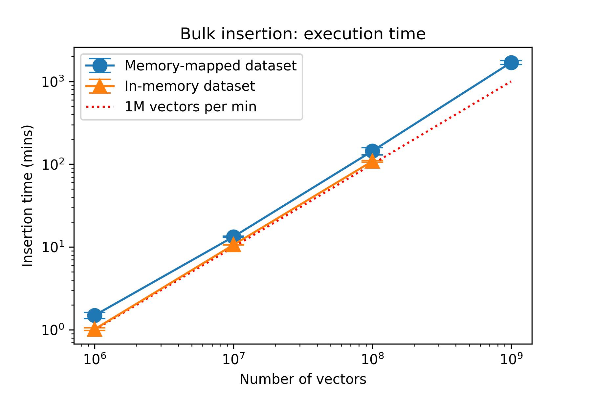

# Benchmarking results of Bulk Insertion using SIFT1M Dataset

## Using manually written benmark
- Input files: in-memory
- Unit of measurement: seconds

### local SSD

```
------------------
Benchmark results:
------------------
Samples: 10
Min: 2.37783
Mean: 3.01146
Max: 4.14631
Std: 0.587107
```
```
------------------
Benchmark results:
------------------
Samples: 10
Min: 2.36291
Mean: 2.65444
Max: 3.85894
Std: 0.418165
```

### local HDD

```
------------------
Benchmark results:
------------------
Samples: 10
Min: 4.69469
Mean: 48.2554
Max: 122.555
Std: 42.8721
```
```
------------------
Benchmark results:
------------------
Samples: 10
Min: 3.28265
Mean: 44.836
Max: 238.895
Std: 69.8488
```

### cluster `/mnt/scratch/`

```
------------------
Benchmark results:
------------------
Samples: 10
Min: 60.138
Mean: 62.2313
Max: 63.6478
Std: 1.03178
```
### cluster `/home/tfercho/`

```
------------------
Benchmark results:
------------------
Samples: 10
Min: 43.2759
Mean: 45.1663
Max: 47.088
Std: 1.09784
```

## Using Catch2 Testing Framework

### Test Setup
```
Scenario: bulk_insert_entries(): load entries belonging to different lists from
          files (vectors, vector_ids, list_ids)
      Given: a vector dimension of 128
  And given: the SIFT1M dataset which has already been clustered and written to
             files according to the format required by bulk_insert_entries()
       Then: the files for the vectors, ids and list ids have been created
             using 'make -C cluster'
  And given: the files are read into memory
```

### local SSD

```
benchmark name                       samples       iterations    estimated
                                     mean          low mean      high mean
                                     std dev       low std dev   high std dev
-------------------------------------------------------------------------------
benchmark bulk insertion                       100             1     4.51191 m 
                                          3.0652 s     3.01102 s     3.12706 s 
                                        295.961 ms    262.046 ms    339.612 ms 


bulk_insert_entries()                          100             1     5.20123 m 
                                          2.7258 s     2.69828 s     2.75911 s 
                                        154.324 ms    130.719 ms    187.959 
```

### local HDD

```
benchmark name                       samples       iterations    estimated
                                     mean          low mean      high mean
                                     std dev       low std dev   high std dev
-------------------------------------------------------------------------------
bulk_insert_entries()                          100             1     27.4084 m 
                                         7.53903 s     6.84251 s     10.3681 s 
                                         6.21698 s     1.27085 s     14.5107 s                                 


bulk_insert_entries()                          100             1     9.73648 m 
                                         11.2931 s     8.89052 s     22.3714 s 
                                         22.7529 s     1.93033 s     54.0923 s 


bulk_insert_entries()                          100             1     9.77748 m 
                                         5.87043 s     5.75211 s     5.99762 s 
                                        626.163 ms    559.886 ms    710.844 ms 
```

### cluster `/home/tfercho`

```
benchmark name                       samples       iterations    estimated
                                     mean          low mean      high mean
                                     std dev       low std dev   high std dev
-------------------------------------------------------------------------------
bulk_insert_entries()                          100             1     85.4657 m 
                                         46.4422 s     45.8477 s     47.1349 s 
                                         3.27968 s     2.91618 s     3.56212 s 

```

### cluster `/mnt/scratch/`

```
benchmark name                       samples       iterations    estimated
                                     mean          low mean      high mean
                                     std dev       low std dev   high std dev
-------------------------------------------------------------------------------
bulk_insert_entries()                          100             1     99.9272 m 
                                         57.9661 s      57.627 s     58.3599 s 
                                          1.8639 s     1.58354 s     2.24536 s 


bulk_insert_entries()                          100             1     105.877 m 
                                         1.01849 m     1.01174 m     1.02541 m 
                                          2.0942 s      1.8135 s     2.44417 s 
```

# Benchmarking results of Bulk Insertion using SIFT10M-1B Dataset

- Working directory: `/mnt/scratch/`

## With files read into memory                                                

### SIFT10M

```
benchmark name                       samples       iterations    estimated
                                     mean          low mean      high mean
                                     std dev       low std dev   high std dev
-------------------------------------------------------------------------------
bulk_insert_entries()                            2             1     20.4762 m 
                                         10.6334 m     10.5574 m     10.6334 m 
                                         4.55587 s          0 ns          0 ns 
```

### SIFT100M

- memory used: 50 GB

```
benchmark name                       samples       iterations    estimated
                                     mean          low mean      high mean
                                     std dev       low std dev   high std dev
-------------------------------------------------------------------------------
bulk_insert_entries() benchmark                  1             1     134.149 m 
                                         111.387 m     111.387 m     111.387 m 
                                              0 ns          0 ns          0 ns 

                                                 1             1     122.006 m 
                                         105.869 m     105.869 m     105.869 m 
                                              0 ns          0 ns          0 ns 
```

## With memory mapped files                                                   
- memory used: 4 GB

### SIFT1M

```

benchmark name                       samples       iterations    estimated
                                     mean          low mean      high mean
                                     std dev       low std dev   high std dev
-------------------------------------------------------------------------------
bulk_insert_entries() benchmark                100             1     152.616 m
                                         1.49576 m      1.4691 m     1.51952 m
                                         7.71382 s     6.68459 s     8.86206 s
```

### SIFT10M

```
benchmark name                       samples       iterations    estimated
                                     mean          low mean      high mean
                                     std dev       low std dev   high std dev
-------------------------------------------------------------------------------
bulk_insert_entries() benchmark                 10             1     135.871 m 
                                         13.3068 m     13.2014 m     13.4911 m
                                         13.2965 s     7.60861 s     19.5831 s 
```

### SIFT100M

```
benchmark name                       samples       iterations    estimated
                                     mean          low mean      high mean
                                     std dev       low std dev   high std dev
-------------------------------------------------------------------------------
bulk_insert_entries() benchmark                  3             1     455.493 m
                                         144.007 m     123.452 m     155.303 m
                                         14.7468 m          0 ns     15.9746 m 
```

### SIFT1B
- Execution time for one iteration including one "warm-up" run: 3384 minutes

```
benchmark name                       samples       iterations    estimated
                                     mean          low mean      high mean
                                     std dev       low std dev   high std dev
-------------------------------------------------------------------------------
bulk_insert_entries() benchmark                  1             1           ? m
                                         1602.82 m     1602.82 m     1602.82 m
                                              0 ns          0 ns          0 ns 
```

# Results

- The execution time of the bulk insertion is linear with the number of entries to be inserted.
- Similarly, while benchmarking, we use memory mapped files to avoid running out of memory.
- While clustering the SIFT1B dataset, we need build the index in batches and merge them as memory mapped inverted lists since the uncompressed index is stored in memory.
- Inserting the SIFT1B dataset into the index takes around 1700 minutes (28 hours) on the cluster. The is equals a rate of 1.5 million entries per minute.
- Compared to loading the input files in-memory, mapping the files to memory increases the execution time by about 33%.


