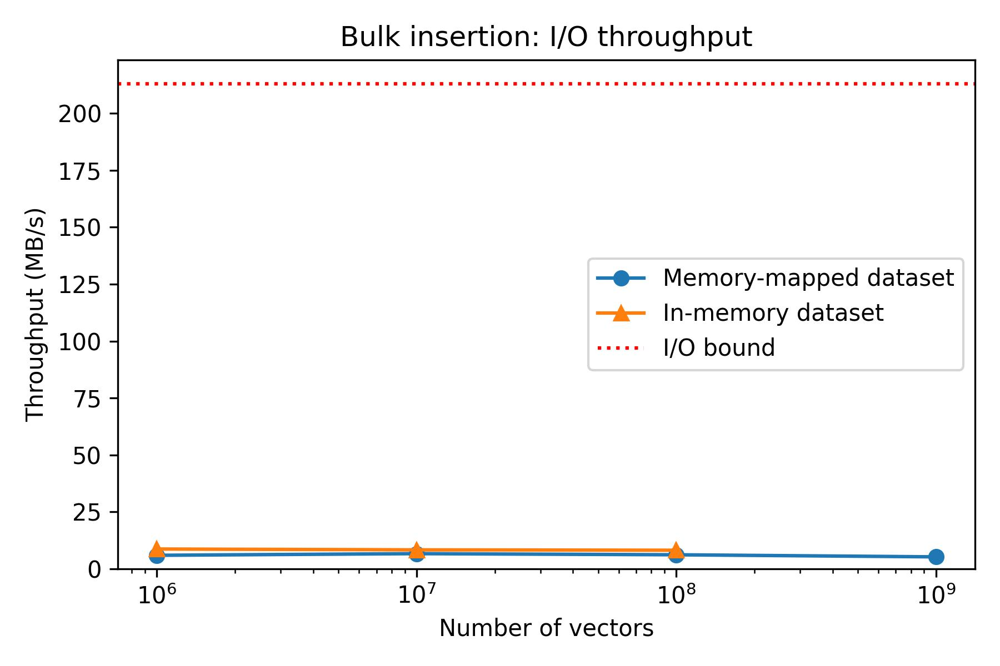

# Benchmarking I/O Throughput of Bulk Insertion

## Measuring the maximum I/O bandwidth of `/mnt/scratch/`

| Configuration      | Value     |
|--------------|-----------|
| Script      | `ann-dkvs/benchmarks/bench_io.py` |
| File size   | 16000 MB |
| #Samples    | 10      |


### Copying a file from /mnt/scratch/ to /mnt/scratch/


```
Benchmarking copying data from /pub/scratch/tfercho/ann-dkvs/benchmarks/io-throughput/tmp/src to /pub/scratch/tfercho/ann-dkvs/benchmarks/io-throughput/tmp/dst
Creating temporary file of size 16000 MB
Run 1 of 10
Run 2 of 10
Run 3 of 10
Run 4 of 10
Run 5 of 10
Run 6 of 10
Run 7 of 10
Run 8 of 10
Run 9 of 10
Run 10 of 10
Throughput: 205.19 +/- 34.9 MB/s
```

### Copying a file from /home/tfercho/ to /home/tfercho/

```
Benchmarking copying data from /home/tfercho/tmp/ to /home/tfercho/tmp/
Creating temporary file of size 16000 MB
Run 1 of 10
Run 2 of 10
Run 3 of 10
Run 4 of 10
Run 5 of 10
Run 6 of 10
Run 7 of 10
Run 8 of 10
Run 9 of 10
Run 10 of 10
Throughput: 223.31 +/- 60.11 MB/s
```

## Measuring the maximum I/O bandwidth of `/mnt/scratch/` (2)

| Configuration      | Value     |
|--------------|-----------|
| Script      | `ann-dkvs/benchmarks/bench_io2.py` |
| File size   | 16000 MB |
| #Samples    | 10      |

### Copying a file from /mnt/scratch/ to /mnt/scratch/
```
Throughput: 213.1 +/- 7.86 MB/s
```

## Results of benchmarking the I/O throughput
- Assuming the measurements are accurate, the I/O utilization is only around 6 MB/s out of 213 MB/s = 3% of the total bandwidth of the network attached drive at /mnt/scratch/.
- This seems very low, and it is not clear why this is the case.
- We should investigate this further to find potential reason for this low utilization or uncover a potential measurement errors, e.g. by:
  - Checking the I/O utilization of the network attached drive at /mnt/scratch/ when running the benchmark.
  - Logging and analysing the I/O access pattern of the `bulk_insert_entries` method.
  - Using some tool to profile the bulk insertion to measure time spent in I/O and other function calls.
  - Manually profiling program by interrupting it while it is running in debug and inspecting the stack trace.


